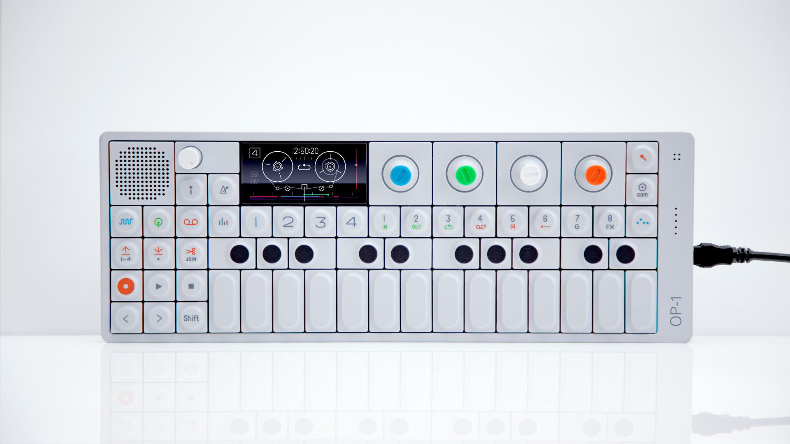

---

OP-Z + Unity = videolab

---

Demonstration

---

OP-Z とは

---

---

---

---

---

[teenageengineering.com](https://www.teenageengineering.com/)

---

OP-1 
キーボード 
弾く楽器

---

OP-Z 
グルーヴボックス 
打ち込む楽器

---

８パート 
２エフェクト 
＋テープ 
＋パンチイン

---

iPhone 連携

---

videolab

[github.com/ teenageengineering/videolab](https://github.com/teenageengineering/videolab)

---

実際に作ってみる

---

videopak = Asset Bundle

---

Asset Bundle から Scene を Additive Load する機能

---

- スクリプトの追加は できない。
- それ以外は（ほぼ） なんでもできる。

---

Unity 5.6 😮

---

実㯠OP-Z ç„¡ã—ã§ã‚‚ 使ãˆã¾ã™

---

まとめ

[github.com/keijiro/VideolabTest](https://github.com/keijiro/VideolabTest)

